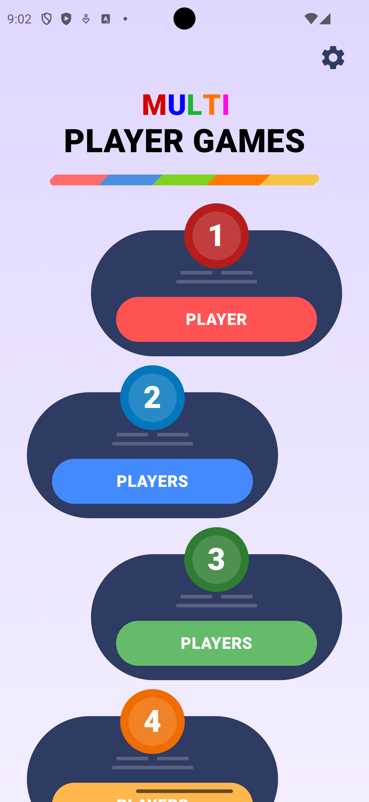
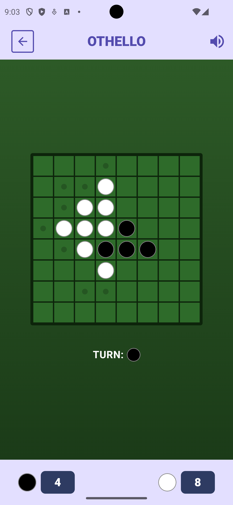
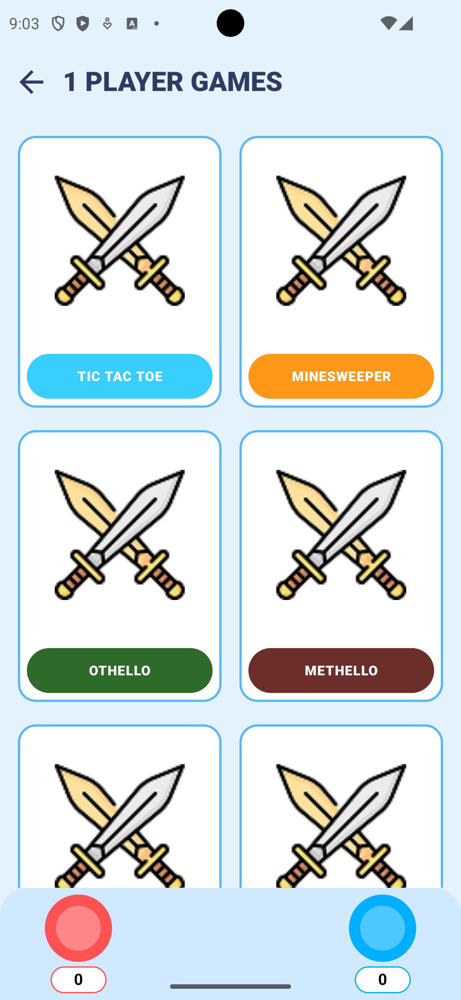

# 🌌 MiniVerse | مینی‌ورس

[English](#english) | [فارسی](#فارسی)

---

## English

## 📜 Description  
**MiniVerse** is a modern, cross-platform gaming hub designed to provide a seamless and engaging experience for solo and multiplayer mini-games.  
Built with **Kotlin Multiplatform (KMP)** and **Compose Multiplatform**, the app runs natively on **Android, iOS, Desktop (Windows/macOS/Linux), and Web**.  
It follows modern Android development practices, utilizing **Material 3** for a vibrant UI and **Koin** for dependency injection, ensuring a scalable and maintainable codebase.

## ✨ Features
- 🌍 **Cross-Platform:** Single codebase for Android, iOS, Desktop, and Web.
- 🎮 **Multiplayer Focus:** Support for 1 to 4 players with a dedicated player selection interface.
- 🕹️ **Mini-Game Hub:** A central place to discover and play various mini-games.
- 🎨 **Material 3 UI:** Modern, responsive design with customized player-themed aesthetics.
- ⚙️ **Customizable Settings:** Easy navigation to app settings and configurations.
- 📲 **Social Sharing:** Built-in sharing functionality to invite friends to the MiniVerse.
- 🚀 **Smooth UX:** Optimized scrolling and drag interactions for a premium feel.
- 🌐 **Multilingual:** Supports both English and Persian (Farsi) with RTL support.

## 🛠 Built With

| Category                  | Technology                                                                                                  |
|---------------------------|-------------------------------------------------------------------------------------------------------------|
| 🏛 Architecture            | Kotlin Multiplatform (KMP)                                                                                  |
| 🖼️ UI Framework            | [Compose Multiplatform](https://github.com/JetBrains/compose-multiplatform) (Material 3)                   |
| 🛠️ Dependency Injection    | [Koin](https://insert-koin.io/)                                                                             |
| 🌐 Networking              | [Ktor](https://ktor.io/)                                                                                    |
| 📜 Serialization           | [Kotlinx Serialization](https://github.com/Kotlin/kotlinx.serialization)                                   |
| 🧭 Navigation              | [Compose Navigation (JetBrains)](https://www.jetbrains.com/help/kotlin-multiplatform-dev/compose-navigation.html) |
| 🔄 Coroutines              | [Kotlinx Coroutines](https://github.com/Kotlin/kotlinx.coroutines)                                         |

---

## فارسی

## 📜 توضیحات  
**مینی‌ورس (MiniVerse)** یک هاب بازی مدرن و چند پلتفرمه است که برای ارائه تجربه‌ای روان و جذاب برای بازی‌های کوچک تک‌نفره و چندنفره طراحی شده است.  
این برنامه با استفاده از **Kotlin Multiplatform (KMP)** و **Compose Multiplatform** ساخته شده و به صورت بومی روی **اندروید، iOS، دسکتاپ (ویندوز/مک/لینوکس) و وب** اجرا می‌شود.  
این پروژه از شیوه‌های مدرن توسعه اندروید پیروی می‌کند و از **Material 3** برای رابط کاربری پویا و **Koin** برای تزریق وابستگی استفاده می‌کند تا کدبیسی مقیاس‌پذیر و قابل نگهداری داشته باشد.

## ✨ ویژگی‌ها
- 🌍 **چند پلتفرمه:** کدبیس واحد برای اندروید، iOS، دسکتاپ و وب.
- 🎮 **تمرکز بر چندنفره:** پشتیبانی از ۱ تا ۴ بازیکن با رابط کاربری اختصاصی انتخاب بازیکن.
- 🕹️ **هاب بازی‌های کوچک:** مکانی مرکزی برای کشف و انجام بازی‌های کوچک مختلف.
- 🎨 **رابط کاربری متریال ۳:** طراحی مدرن و پاسخگو با زیبایی‌شناسی سفارشی شده برای بازیکنان.
- ⚙️ **تنظیمات قابل شخصی‌سازی:** ناوبری آسان به تنظیمات و پیکربندی‌های برنامه.
- 📲 **اشتراک‌گذاری اجتماعی:** قابلیت داخلی اشتراک‌گذاری برای دعوت دوستان به مینی‌ورس.
- 🚀 **تجربه کاربری روان:** بهینه‌سازی شده برای اسکرول و تعاملات درگ (Drag) برای حس بهتر.
- 🌐 **دوزبانه:** پشتیبانی از هر دو زبان انگلیسی و فارسی با پشتیبانی کامل از راست‌چین (RTL).

## 🛠 ساخته شده با

| دسته‌بندی | تکنولوژی |
| :--- | :--- |
| 🏛 معماری | Kotlin Multiplatform (KMP) |
| 🖼️ فریم‌ورک UI | [Compose Multiplatform](https://github.com/JetBrains/compose-multiplatform) (Material 3) |
| 🛠️ تزریق وابستگی | [Koin](https://insert-koin.io/) |
| 🌐 شبکه | [Ktor](https://ktor.io/) |
| 📜 سریال‌سازی | [Kotlinx Serialization](https://github.com/Kotlin/kotlinx.serialization) |
| 🧭 ناوبری | [Compose Navigation](https://www.jetbrains.com/help/kotlin-multiplatform-dev/compose-navigation.html) |
| 🔄 کوروتین‌ها | [Kotlinx Coroutines](https://github.com/Kotlin/kotlinx.coroutines) |

---

## 🚀 Development & Deployment | توسعه و استقرار

### 🛠 Development Run | اجرای توسعه
| Platform | Command |
| :--- | :--- |
| **Android** | `./gradlew :androidApp:installDebug` |
| **Desktop** | `./gradlew :desktopApp:run` |
| **Web (Wasm)** | `./gradlew :webApp:wasmJsBrowserDevelopmentRun` |
| **Web (JS)** | `./gradlew :webApp:jsBrowserDevelopmentRun` |
| **iOS** | Open `iosApp` in Xcode and Run |

### 📦 Production Build (Release) | ساخت نسخه نهایی
| Platform | Build Command | Output Format |
| :--- | :--- | :--- |
| **Android** | `./gradlew :androidApp:assembleRelease` | `.apk` (Signed) |
| **Windows** | `./gradlew :desktopApp:packageMsi` | `.msi` |
| **macOS** | `./gradlew :desktopApp:packageDmg` | `.dmg` |
| **Linux** | `./gradlew :desktopApp:packageDeb` | `.deb` |
| **Web (Wasm)** | `./gradlew :webApp:wasmJsBrowserDistribution` | Static Files |
| **Web (JS)** | `./gradlew :webApp:jsBrowserDistribution` | Static Files |
| **iOS** | `./gradlew :shared:linkReleaseFrameworkIosArm64` | `.framework` |

### 📂 Build Artifacts Location | محل فایل‌های خروجی
| Platform | Output Path |
| :--- | :--- |
| **Android** | `androidApp/build/outputs/apk/release/` |
| **Windows** | `desktopApp/build/compose/binaries/main/msi/` |
| **macOS** | `desktopApp/build/compose/binaries/main/dmg/` |
| **Linux** | `desktopApp/build/compose/binaries/main/deb/` |
| **Web (Wasm)** | `webApp/build/dist/wasmJs/productionExecutable/` |
| **Web (JS)** | `webApp/build/dist/js/productionExecutable/` |
| **iOS** | `shared/build/bin/iosArm64/releaseFramework/` |

### 🤖 Automated CI/CD (GitHub Actions) | خودکارسازی
This project is equipped with GitHub Actions for automated building of all platforms.
این پروژه به گیت‌هاب اکشنز برای ساخت خودکار تمامی پلتفرم‌ها مجهز شده است.

## 📱 Screenshots | اسکرین‌شات‌ها

<table style="width:100%">
  <tr>
    <th>Home Screen</th>
    <th>Game Board</th> 
    <th>Select Game</th> 
  </tr>
  <tr>
    <td></td> 
    <td></td>
    <td></td>
  </tr>
</table>
